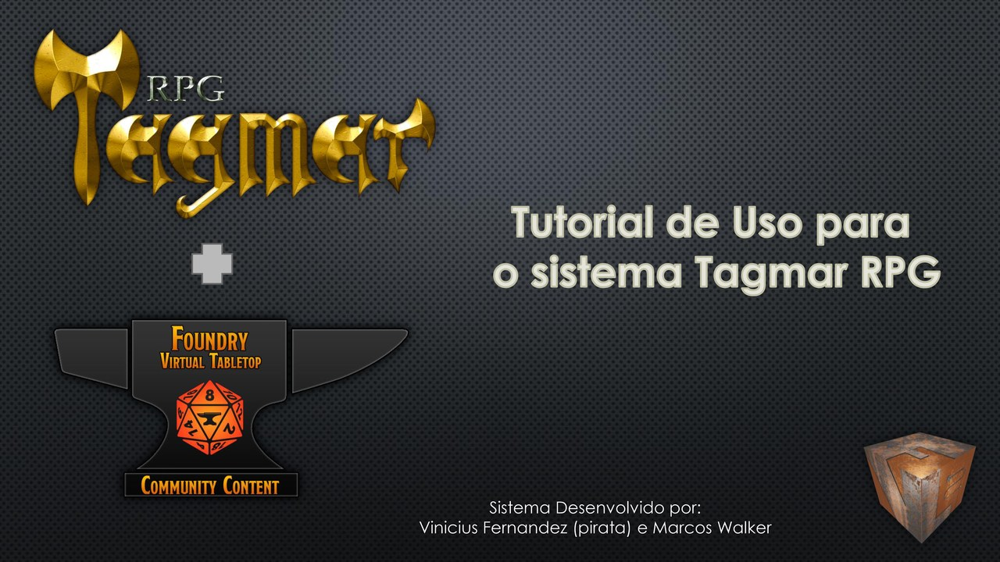

# Licença
Todo material produzido e distribuido pelo projeto Tagmar é derivado do livro “Tagmar – RPG de Aventura Medieval” © 1991 de autoria de Marcelo Rodrigues,  Ygor Moraes Esteves da Silva, Julio Augusto Cezar Junior e Leonardo Nahoum Pache de Faria; e está licenciado de acordo as seguintes condições: Atribuição-NãoComercial-CompartilhaIgual 3.0 Brasil.

Você pode:
* Imprimir, Copiar, distribuir, exibir e executar a obra.
* Criar obras derivadas.

Sob as seguintes condições:

* **Atribuição.** Você deve dar crédito ao autor original. 
* **Uso Não-Comercial.** Você não pode utilizar esta obra com finalidades comerciais. 
* **Compartilhamento pela mesma Licença.** Se você alterar, transformar, ou criar outra obra com base nesta, você somente poderá distribuir a obra resultante sob uma licença idêntica a esta. Para cada novo uso ou distribuição, você deve deixar claro para outros os termos da licença desta obra.
* **Impressão sob demanda:** esta permissão autoriza que pessoas físicas ou jurídicas a cobrar pelo serviço de impressão sob demanda dos livros do Tagmar disponibilizados no site www.tagmar.com.br nas seguintes condições:
    1. Fica autorizada a cobrança do serviço de impressão, encadernamento e de envio, desde que os preços sejam compatíveis com os preços normais de mercado de impressão, encadernamento e envio; 
    2. Só será permitida a cobrança do serviço de impressão, encadernamento e de envio se o solicitante do serviço for uma pessoa física; 
    3. O serviço prestado poderá ser em lojas físicas ou online; 
    4. Continua vetado a impressão para revenda em lojas físicas ou online. Quem imprime deverá prestar o serviço direto a quem irá utilizar os livros. Quem adquire os livros não poderá revendê-los; 
    5. Continua vetada a cobrança oriunda de qualquer natureza para as versões digitais; 
    6. Todos os demais termos da licença creative commons “Atribuição-NãoComercial-CompartilhaIgual 3.0 Brasil” deverão ser cumpridos.

Qualquer uma destas condições acima podem ser renunciadas, desde que Você obtenha permissão do autor.
Este licenciamento segue um padrão obra aberta e está registrado pela seguinte licença da Creative Commons: [Creative Commons](http://creativecommons.org/licenses/by-nc-sa/3.0/br/) com validade legal no Brasil e por muitos outros países. 

   

                            